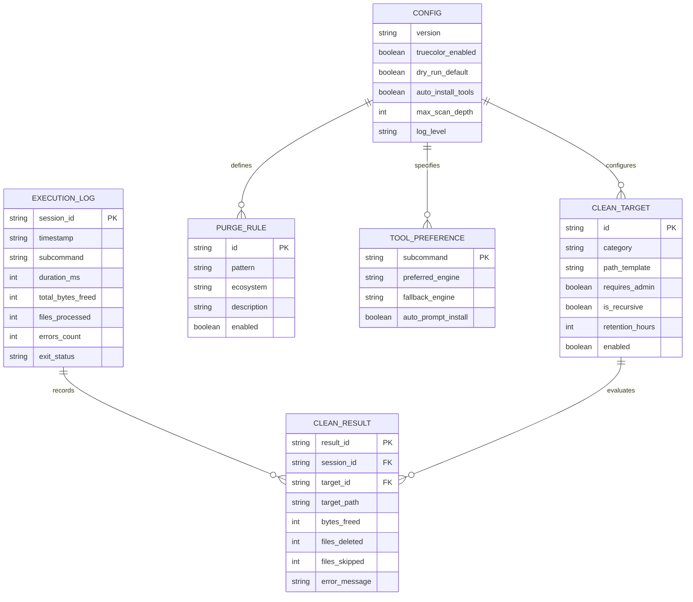

# 5. Backend Schema & State Models — WinMole

> **Project Name:** WinMole (`winmole` / `mo`)  
> **Storage Paradigm:** Local JSON Configuration & Operational State Files  
> **Root Directory:** `$env:USERPROFILE\.winmole\`  
> **Zero Cloud Dependency:** All operational data and history remain strictly on the local machine.

---

## 1. Storage Architecture & File Layout

WinMole persists state and configuration in the user's home directory under a dedicated `.winmole` folder:

```
$env:USERPROFILE\.winmole\
├── config.json          # User preferences, tool preferences, and safety thresholds
├── targets.json         # Extensible registry of clean targets and purge folder rules
├── history.jsonl        # Operational audit log of cleanup sessions and disk reclaimed
└── cache\               # Temporary execution caches (e.g. winget list cache)
    └── winget_cache.json
```

---

## 2. Entity-Relationship Model



---

## 3. Data Schemas & JSON Specifications

### 3.1 Configuration Schema (`config.json`)
```json
{
  "$schema": "https://json-schema.org/draft/2020-12/schema",
  "version": "1.0.0",
  "ui": {
    "truecolor_enabled": true,
    "theme": "dark_modern",
    "show_banner_tips": true,
    "refresh_rate_ms": 1000
  },
  "safety": {
    "dry_run_default": false,
    "confirm_deletions": true,
    "max_purge_depth": 5,
    "protected_paths": [
      "C:\\",
      "C:\\Windows",
      "C:\\Program Files",
      "C:\\Program Files (x86)",
      "C:\\Users"
    ]
  },
  "tools": {
    "status": {
      "preferred": "bottom",
      "binary": "btm.exe",
      "winget_id": "Clement.bottom",
      "fallback": "native"
    },
    "analyze": {
      "preferred": "gdu",
      "binary": "gdu.exe",
      "winget_id": "gdu",
      "fallback": "native"
    },
    "purge": {
      "preferred": "kondo",
      "binary": "kondo.exe",
      "install_cmd": "cargo install kondo",
      "fallback": "native"
    },
    "clean": {
      "preferred": "native",
      "binary": "native",
      "fallback": "native"
    }
  }
}
```

### 3.2 Clean Targets Schema (`targets.json`)
```json
{
  "version": "1.0.0",
  "clean_targets": [
    {
      "id": "user_temp",
      "category": "temp",
      "description": "User Temporary Directory",
      "path_template": "%TEMP%",
      "requires_admin": false,
      "retention_hours": 24,
      "enabled": true
    },
    {
      "id": "system_temp",
      "category": "temp",
      "description": "Windows System Temp Directory",
      "path_template": "%SYSTEMROOT%\\Temp",
      "requires_admin": true,
      "retention_hours": 48,
      "enabled": true
    },
    {
      "id": "crash_dumps",
      "category": "system",
      "description": "User Crash Dumps",
      "path_template": "%LOCALAPPDATA%\\CrashDumps",
      "requires_admin": false,
      "retention_hours": 0,
      "enabled": true
    },
    {
      "id": "prefetch",
      "category": "system",
      "description": "Windows Prefetch Cache",
      "path_template": "%SYSTEMROOT%\\Prefetch",
      "requires_admin": true,
      "retention_hours": 0,
      "enabled": false
    }
  ],
  "purge_rules": [
    {
      "id": "node_modules",
      "pattern": "node_modules",
      "ecosystem": "JavaScript/Node.js",
      "description": "Node package dependencies",
      "enabled": true
    },
    {
      "id": "python_venv",
      "pattern": ".venv|venv",
      "ecosystem": "Python",
      "description": "Python virtual environments",
      "enabled": true
    },
    {
      "id": "python_cache",
      "pattern": "__pycache__",
      "ecosystem": "Python",
      "description": "Python bytecode cache",
      "enabled": true
    },
    {
      "id": "rust_target",
      "pattern": "target",
      "ecosystem": "Rust/Cargo",
      "description": "Cargo compilation artifacts",
      "enabled": true
    },
    {
      "id": "dotnet_bin_obj",
      "pattern": "bin|obj",
      "ecosystem": ".NET/C#",
      "description": ".NET compiled output",
      "enabled": true
    },
    {
      "id": "web_framework_build",
      "pattern": ".next|.nuxt|dist|build",
      "ecosystem": "Web Frameworks",
      "description": "Production builds and cache",
      "enabled": true
    }
  ]
}
```

### 3.3 Operational History Log (`history.jsonl`)
Stored as append-only JSON Lines format for fast, concurrent writes:
```json
{"session_id":"wm-8291a","timestamp":"2026-09-24T14:30:00Z","subcommand":"clean","duration_ms":1240,"total_bytes_freed":2684354560,"files_deleted":3842,"errors_count":0,"dry_run":false}
{"session_id":"wm-8291b","timestamp":"2026-09-24T14:35:12Z","subcommand":"purge","duration_ms":3120,"total_bytes_freed":7633597440,"files_deleted":31200,"errors_count":0,"dry_run":false}
```

---

## 4. In-Memory Data Models & Object Types

During execution, PowerShell cmdlets pass structured objects through the internal pipeline:

```powershell
class WinMoleTargetResult {
    [string]$TargetId
    [string]$Path
    [int64]$BytesReclaimed
    [int]$FilesDeleted
    [int]$FilesSkipped
    [string[]]$LockedFiles
    [bool]$Success
}

class WinMoleArtifactDirectory {
    [string]$Path
    [string]$ArtifactType
    [int64]$SizeBytes
    [datetime]$LastModified
    [int]$FileCount
}
```
